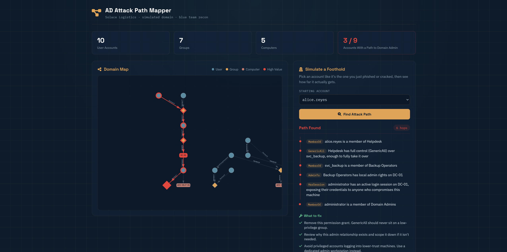

# AD Attack Path Mapper

A blue team tool that visualizes how an attacker could climb from a
low-privilege account to Domain Admin inside a company's network, the
same question professional tools like BloodHound answer against a real
Active Directory domain.



## How it works

There's no real Active Directory behind this. The environment lives in
`data/ad_environment.json`, a simulated company ("Solace Logistics")
with realistic users, groups, computers, and permission relationships
between them, `MemberOf`, `AdminTo`, `GenericAll`, `GenericWrite`,
`ForceChangePassword`, `HasSession`, the same relationship types real AD
security tools track.

Pick a starting account like it's the one you just phished, and the tool
uses graph pathfinding (`networkx`) to find the shortest route from that
account to the Domain Admins group, then translates each hop into a plain
English sentence and a concrete fix, not just "here's a scary graph."

Not every account has a path. Out of the 9 non-admin accounts in this
environment, only 3 can actually reach Domain Admin, the rest are dead
ends. That's intentional and realistic, most accounts in a real domain
are perfectly safe, the interesting part is finding the few that aren't.

## Install

Requires Python 3.9+.

```bash
cd ad-attack-path-mapper
python -m venv venv
venv\Scripts\activate          # Windows (or venv\Scripts\python.exe / pip.exe directly if activation is blocked)
pip install -r requirements.txt
```

## Run

```bash
python app.py
```

Then open **http://127.0.0.1:5001**

## Trying it out

- Pick **alice.reyes** or **ben.tan** (Helpdesk) or **svc_backup** from
  the dropdown and hit "Find Attack Path", you'll get a 6-hop chain
  straight to Domain Admins, with the path highlighted on the graph.
- Pick **erika.lim**, **felix.santos**, **grace.villanueva**,
  **carla.mendoza**, **dennis.uy**, or **svc_web** instead, these are
  dead ends, the tool will tell you the account looks safely contained.

## Project structure

```
ad-attack-path-mapper/
├── app.py                      Flask routes
├── graph.py                    pathfinding + plain-English narrative logic
├── data/
│   └── ad_environment.json     the simulated company's AD structure
├── templates/
│   └── dashboard.html
└── static/
    ├── style.css                blueprint/intelligence-map theme
    └── dashboard.js             graph rendering + path highlighting
```
